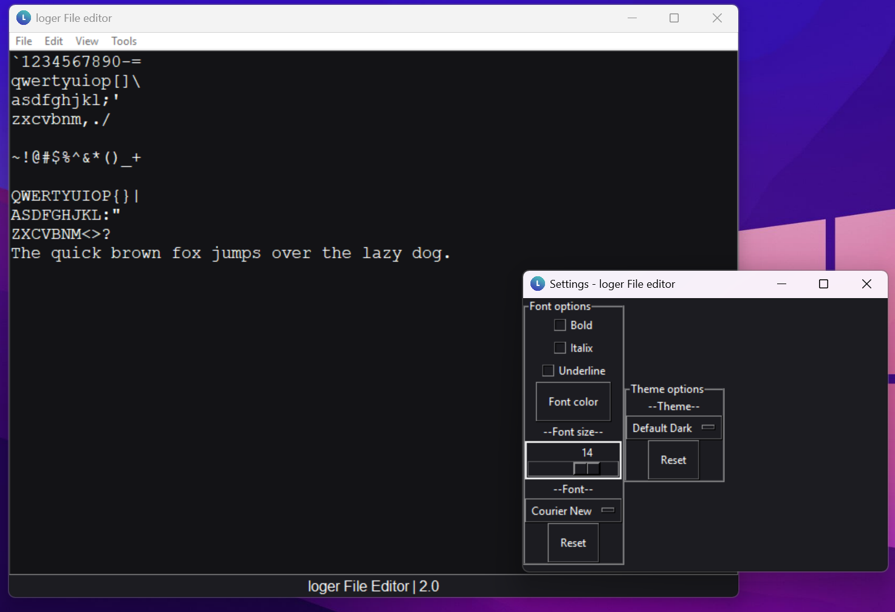
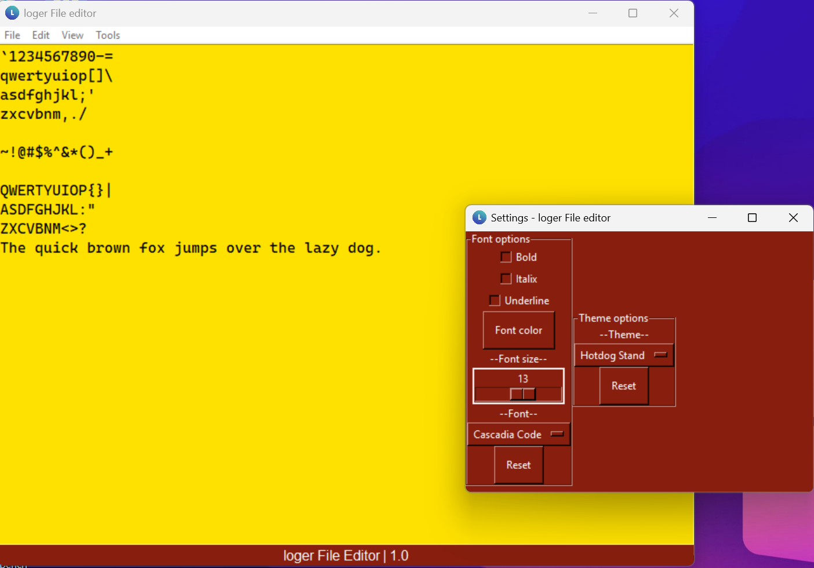

# loger File editor

loger File editor is a Python program for editing files.
It is easy to make addons for too. (more plugin functionalty is comming)

> Defualt dark theme 

> Hotdog stand theme (from windows 3.1)
## Install and running

To install the program:
 1. Download and install any supported version of Python 3
 2. Install the `illium.ttf` font (optional)
 3. open `loger_file_editor.py` on the desktop or in a terminal
     - If a terminal window opens too, check to see if the debug flag is
          enabled in  `runtimeOptions.properties` it will look like this `debug = TRUE` and set it to `debug = FALSE`

The code is in `gui.py`. All dependencies other than Python are included and located in `scr/libraries/`. All themes are in `scr/assets/themes/` along with other images. 
**ERRORS MAY OCCUR IN AN IDE DUE TO PROJECT CONFIG OPTIONS. FOR USE OF SOFTWARE OUTSIDE A DEV ENVIROMENT RUN WITH ABOVE INSTRUCTIONS!** 
## Goal
The goal of loger File editor was just to have a costomizable file editor, but it has morphed into a tool for working with some strange file formats. 
Our goals inculude:
 - Making a file editor that can work with weird custom formats
 - Making a file editor that is highly customizeable

## Contributing
To contribute or modify in any way:
 1. Fork the main branch
 2. Have contribution in your ReadME or in the program it's self

## Issues
All issues should be raised on the [issues page](https://github.com/loger97/loger-File-editor/issues)

## Supported Versions of loger file editor & Python

Versions of loger file editor that you can open an issue on.
| Version | Supported          |
| ------- | ------------------ |
| 2.0     | :warning:          |
| 1.0     | :white_check_mark: |
| P.R.    | :warning:          |
| Beta    | :x:                |
| Alpha   | :x:                |
## Versions of Python that work with loger File editor.

| Version | Supported          |
| ------- | ------------------ |
| ≥ 3.15  | :x:                |
| 3.14    | :white_check_mark: |
| 3.13    | :white_check_mark: |
| 3.12 - 3.11| :warning:       |
| ≤ 3.10   | :x:               |
